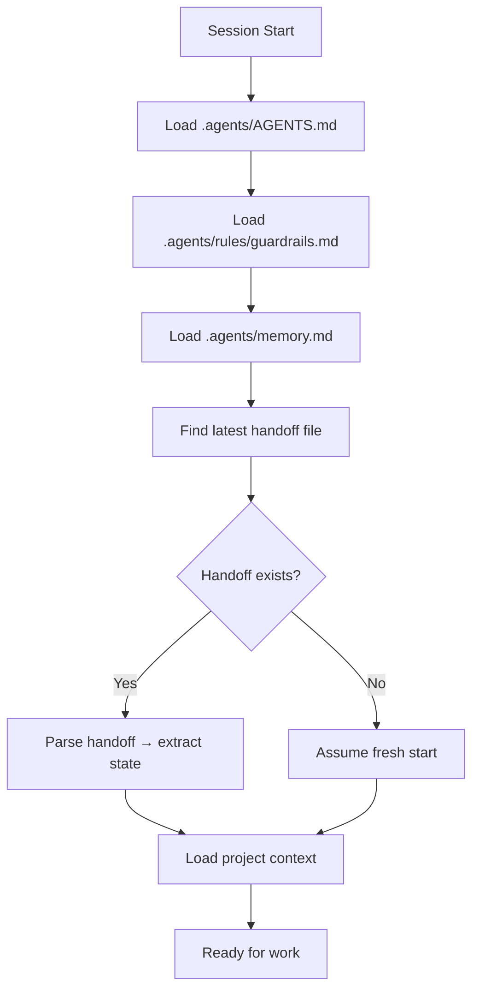
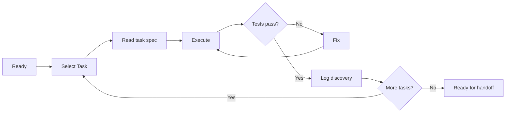
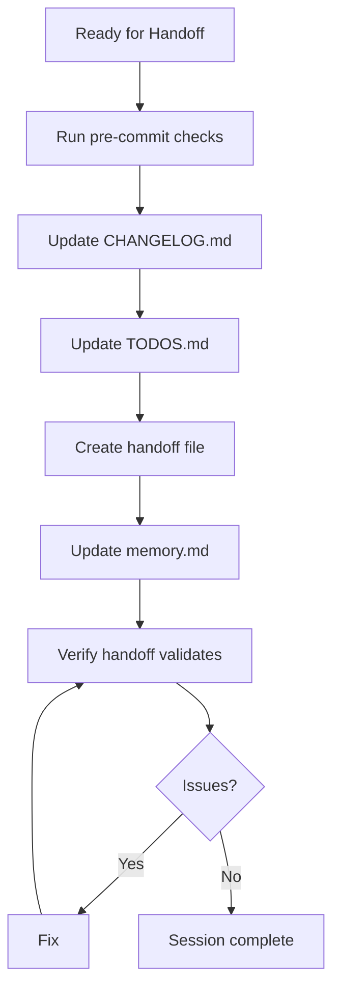

<!--
╔══════════════════════════════════════════════════════════════╗
║              .agents/rules/lifecycle.md                      ║
║  Session Lifecycle Management                                ║
║  Start → Handoff → End — Enforced by ALL agents             ║
╚══════════════════════════════════════════════════════════════╝
-->

# Session Lifecycle

Every agent session follows a strict lifecycle with three phases.  
This document defines what happens in each phase and the artifacts produced.

---

## Phase 1: START

Triggered when a new agent session begins.

### Steps

### Artifacts Produced
- None (consumes previous handoff)

### Verification Checklist
- [ ] Latest handoff file read and understood
- [ ] Memory file read and incorporated
- [ ] Guardrails loaded and acknowledged
- [ ] Project context loaded from `.opencode/instructions/`

---

## Phase 2: WORK

The main execution phase — tasks are performed.

### Steps

### Artifacts Produced
- Code changes (in working tree)
- Updated test files
- Updated knowledge base entries
- Memory updates (`.agents/memory.md`)

### Rules During WORK
1. Only one task `in_progress` at a time
2. Discoveries logged immediately (not batched at end)
3. Tests run after every implementation change
4. Errors documented as they occur

---

## Phase 3: HANDOFF

Triggered when the session is ending or handing off to another agent.

### Steps

### Artifacts Produced
1. **Handoff file**: `.agents/handoffs/YYYYMMDD-HHMMSS-<agent>-<label>.md`
2. **Memory update**: `.agents/memory.md` with new discoveries
3. **File updates**: CHANGELOG.md, TODOS.md updated

### Handoff Content Requirements
Every handoff file MUST contain:
1. **Metadata**: session_id, timestamp, source_agent, target_agent
2. **Context**: branch, last_commit, tasks_completed, tasks_pending
3. **Discoveries**: New learnings (domain, finding, severity, action)
4. **Errors**: Errors encountered with solutions
5. **State**: Build status, test counts, known issues
6. **Next actions**: Prioritized list for next session
7. **Open questions**: Things not yet decided

---

## Session Types

### Full Session
A complete lifecycle: START → WORK (multiple tasks) → HANDOFF
- Duration: Multiple tasks, possibly hours
- Artifacts: Full handoff with all discoveries

### Quick Session
A minimal lifecycle: START → WORK (1 task) → HANDOFF
- Duration: Single task, < 30 minutes
- Artifacts: Minimal handoff with at least 1 discovery

### Review Session
START → REVIEW → HANDOFF
- Duration: Code review only, no implementation
- Artifacts: Handoff with review findings

### Error Recovery Session
START → DIAGNOSE → FIX → HANDOFF
- Duration: Emergency fix
- Artifacts: Handoff with error root cause and fix

---

## Session Continuity

### Cross-Session Handoff
When Session B starts after Session A's handoff:
1. Session B reads Session A's handoff file
2. Session B incorporates A's discoveries into memory
3. Session B begins with A's `next_session` priority list
4. Session B appends its own handoff when done

### Parallel Sessions
If multiple agents run simultaneously:
1. Each agent creates its own handoff with unique session_id
2. The orchestrator merges findings when both complete
3. Conflicting findings are flagged for human resolution

### Stale Handoff Detection
Handoff files older than 7 days are considered "stale":
1. Agent reads the handoff for context
2. Agent verifies each next_session item is still relevant
3. Agent marks stale items as `[STALE]` in new handoff
4. Agent creates new handoff with refreshed priority

---

## Error States

| State | Trigger | Recovery |
|-------|---------|----------|
| **No handoff** | Fresh environment, no .agents/ | Assume clean start |
| **Corrupt handoff** | Invalid YAML/JSON in handoff | Report error, use last valid |
| **Stale handoff** | >7 days old | Read for context, mark stale |
| **Conflicting handoff** | Two agents wrote same timestamp | Use lexicographic order |
| **Missing memory** | .agents/memory.md deleted | Rebuild from handoff history |

---

## Change History

| Date       | Change                                            |
|------------|----------------------------------------------------|
| 2026-07-16 | Initial creation — session lifecycle               |
